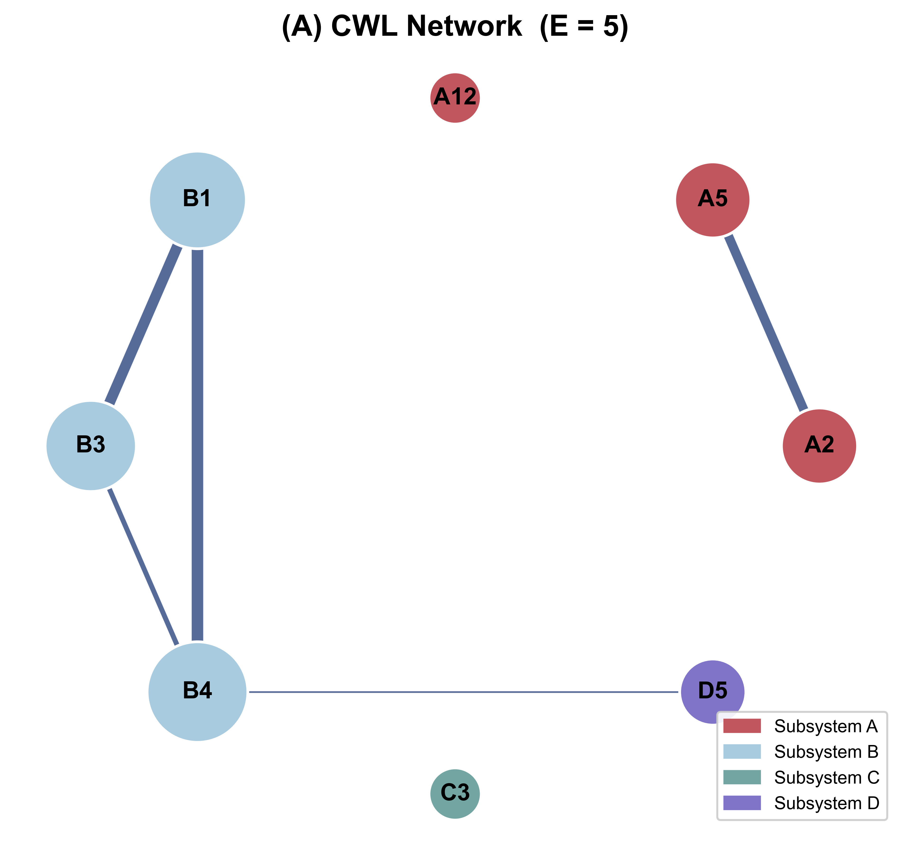
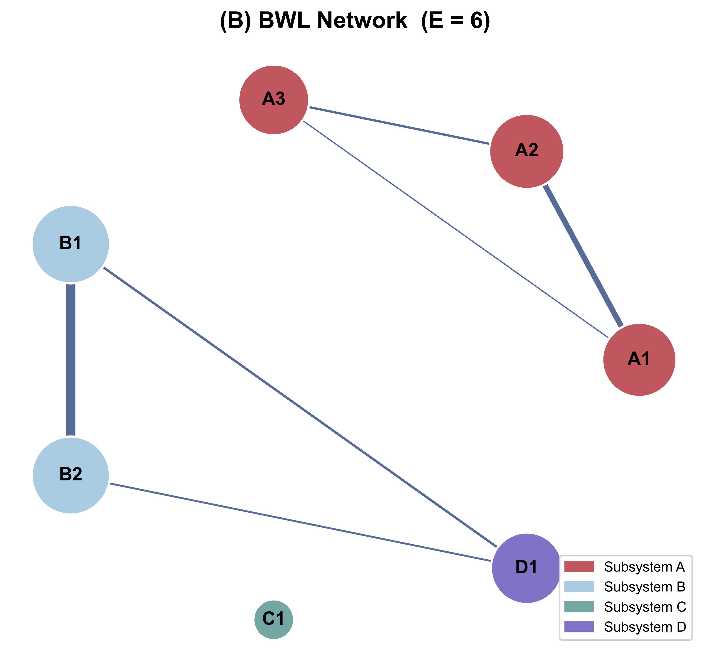
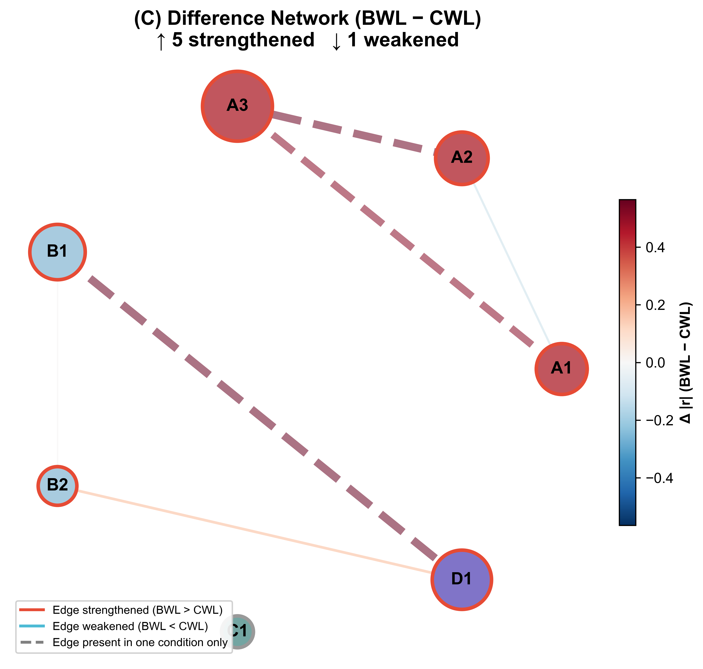
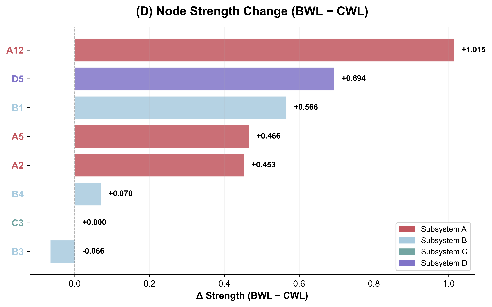
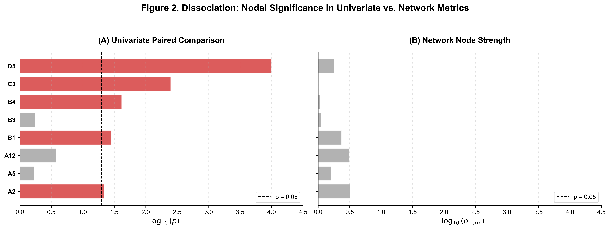
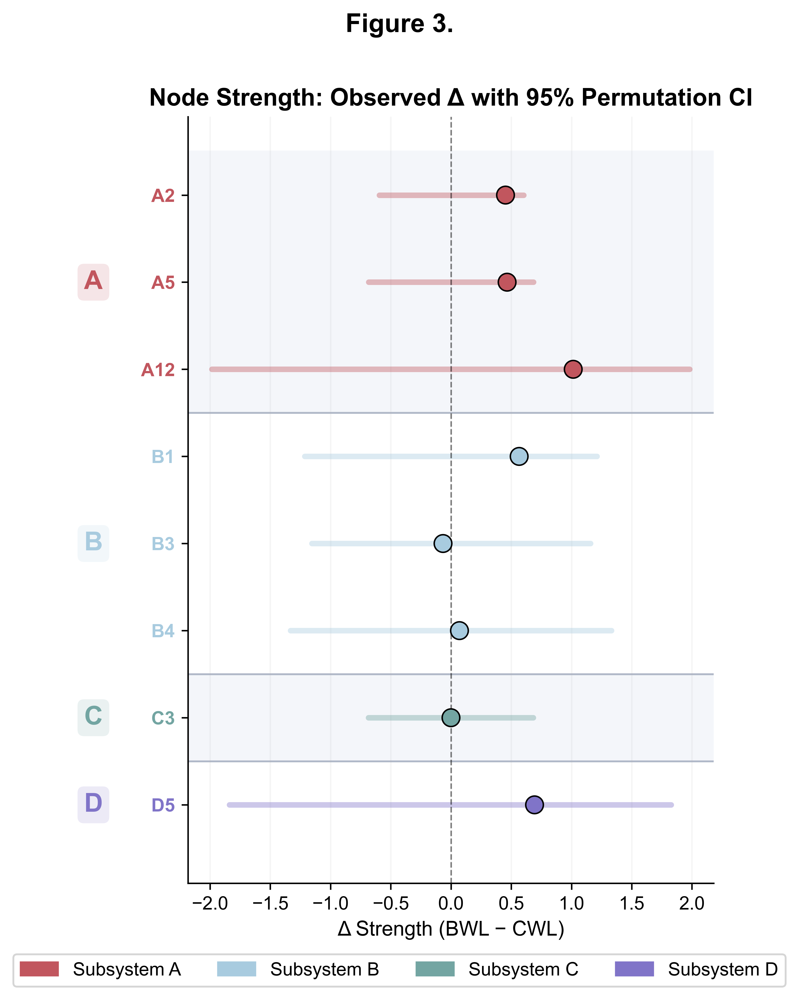
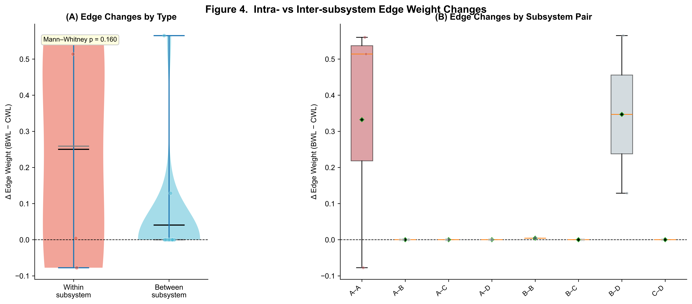
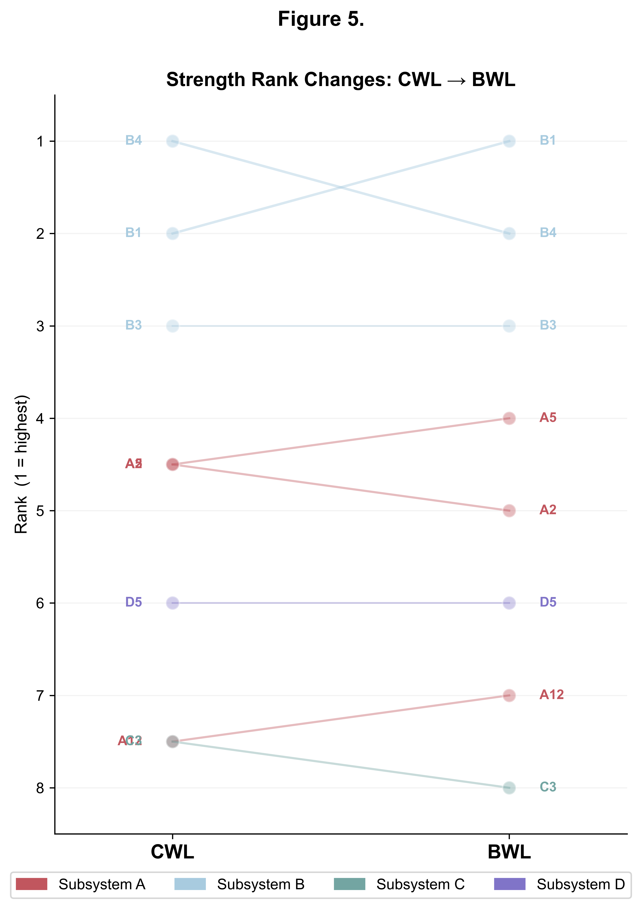

# Cross-Condition Network Analysis

[](https://www.python.org/)
[](LICENSE)

## Overview

This repository contains the data and analysis code for the paper:

> **Your Paper Title Here**  
> Author 1, Author 2 (2026). *Journal Name*.

We implement a **correlation-based network analysis** comparing two experimental conditions (CWL vs. BWL) using sign-flip permutation inference on global, node-level, and edge-level network metrics. The entire analysis is fully reproducible from raw data to final figures in a single Jupyter notebook.

## Method Summary

| Step | Description |
|------|-------------|
| Network construction | Spearman correlation matrix; edges thresholded at *p* < .05 |
| Node metric | Weighted strength |
| Global metrics | Density, global efficiency, clustering coefficient, modularity, characteristic path length |
| Inference | 10,000 sign-flip permutations (paired design) |
| Multiple-comparison correction | Benjamini–Hochberg FDR |

## Key Results

### Figure 1 — Condition-Specific Networks

| (A) CWL Network | (B) BWL Network |
|:----------------:|:----------------:|
|  |  |

### Figure 1c — Difference Network (BWL − CWL)



### Figure 1d — Node Strength Change



### Figure 2 — Dissociation: Univariate vs. Network Significance



### Figure 3 — Forest Plot (Node Strength ± 95% Permutation CI)



### Figure 4 — Intra- vs. Inter-subsystem Edge Changes



### Figure 5 — Strength Rank Changes (Bump Chart)



## Repository Structure

```
.
├── data/                       # Raw data (not included in repo)
├── output/figures/             # Generated figures
├── CAN_network_analysis.ipynb  # Main analysis notebook
├── requirements.txt            # Python dependencies
├── LICENSE                     # MIT License
└── README.md                   # This file
```

## Installation

```bash
git clone https://github.com/YKang97/CAN_network_analysis.git
cd CAN_network_analysis
pip install -r requirements.txt
```

## How to Reproduce

1. Clone this repository
2. Install dependencies: `pip install -r requirements.txt`
3. Place your data file at `./data/CAN.xlsx`
4. Open `CAN_network_analysis.ipynb` in Jupyter
5. Run all cells sequentially (Cell 1 → Cell 6)

## Data Availability

Raw data are available upon reasonable request from the corresponding author. The data file is not included in this repository to protect participant privacy.

## Citation

If you use this code, please cite:

```bibtex
@article{Kang2026,
  title   = {Your Paper Title},
  author  = {Kang, Y. and ...},
  journal = {Journal Name},
  year    = {2026},
  doi     = {YOUR_DOI_HERE}
}
```

## License

This project is licensed under the MIT License. See [LICENSE](LICENSE).
